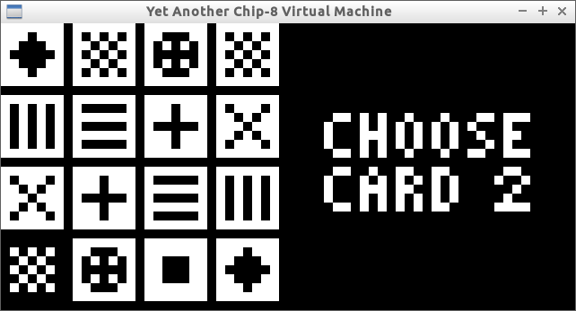
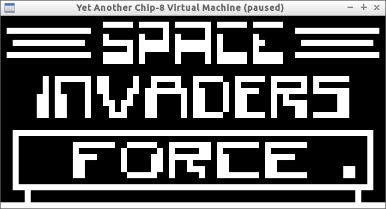
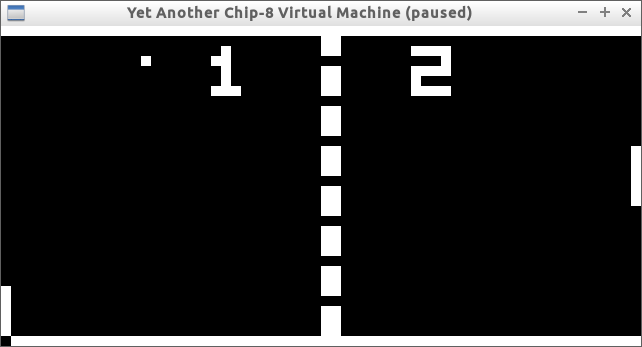

### yac8vm ###

Yet Another Chip-8 Virtual Machine (initial development, 2015)

### Installation ###

```
$ brew install sdl2 pkg-config # or equivalent
$ go get github.com/qx89l4/yac8vm
```

### Usage ###

```
$ ROMPATH=$(go env GOPATH)/src/github.com/qx89l4/yac8vm/roms
$ ls $ROMPATH
$ yac8vm run $ROMPATH/romfile  # execute ROM
$ yac8vm dis $ROMPATH/romfile  # disassemble ROM
```

### Keyboard ###

```
[1][2][3][4]      [1][2][3][C]
[Q][W][E][R]  =>  [4][5][6][D]
[A][S][D][F]      [7][8][9][E]
[Z][X][C][V]      [A][0][B][F]

P       => Pause execution
Escape  => Break execution
```

### Links ###

- http://devernay.free.fr/hacks/chip8/C8TECH10.HTM - Cowgod's Chip-8 Technical Reference
- http://www.pong-story.com/chip8/ - David Winter's CHIP-8 emulation page

### Screenshots ###






